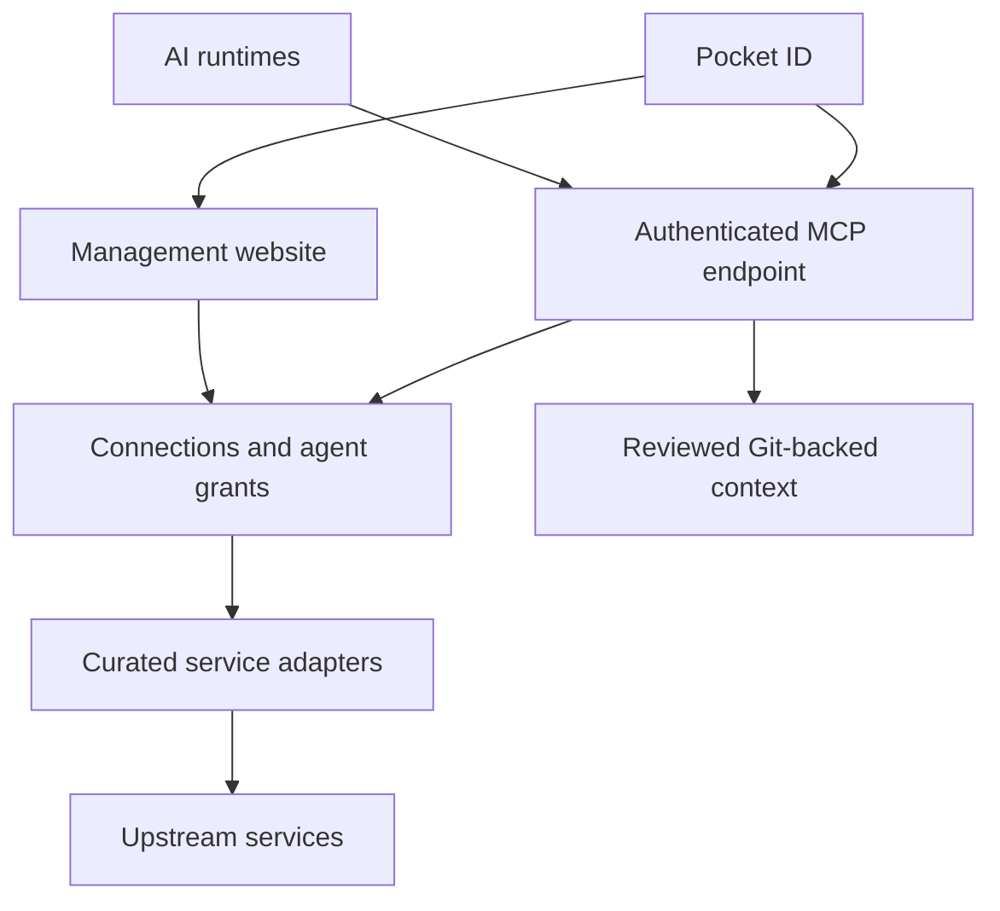

# Architecture and Pocket ID

Proposed design; no components have been deployed by this project.

## Accounts and ownership

Multiple users may connect separate accounts to the same service. Connections are personal by default; shared use requires explicit grants. Each request identifies its initiating principal, agent enrollment, workspace, and the upstream credential account. See [Accounts and access](ACCOUNTS-AND-ACCESS.md) for roles, isolation, and attribution requirements.

## Three authentication boundaries

1. **Human to dashboard:** Pocket ID OIDC login. Map identity by verified issuer and subject, not email. Restrict eligibility explicitly; identity-provider administrator status does not automatically grant hub administrator access.
2. **Runtime to hub:** authenticated HTTP MCP. Prefer OAuth, with separate, revocable scoped credentials for supported unattended clients. Never trust a caller-supplied agent name as its identity.
3. **Hub to upstream:** independently stored service credentials. Use an existing MCP server where suitable, or a curated direct API adapter where necessary. Do not pass hub access tokens through to upstream services.

## Pocket ID flow

Register the dashboard as an OIDC client with exact callback URLs. Register the MCP service as an API resource using its final canonical identifier. Proposed scopes include `inventory:read`, `home:read`, `home:control`, and `git:read`.

The MCP endpoint advertises protected-resource metadata pointing to Pocket ID. A compatible runtime initiates authorization, the user signs in and consents, and the runtime obtains an access token for this service. The hub validates signature, issuer, audience, expiry, and scope on every call before applying active enrollment and target grants. OIDC ID tokens must not be accepted as API access tokens.

Begin with explicitly registered clients. Client ID Metadata Documents may be allowed for compatible runtimes using exact approved URLs. Avoid blanket access for future clients. Verify token client-identity claims and whether shared runtime OAuth client IDs permit per-installation revocation.

For background agents, evaluate Pocket ID machine-to-machine access only where both sides support it; otherwise use a separately scoped gateway credential. Never give agents an identity-provider administration API key.

Current Pocket ID documentation describes these capabilities; verify the installed version and selected gateway against them. Generic dashboard OIDC support is not proof of complete MCP authorization compatibility. A gateway may issue its own runtime tokens after Pocket ID login; document the actual issuer and revocation boundary if this model is selected.

## Revocation

Pocket ID login/group changes may not invalidate existing application sessions or issued tokens immediately. Check local disabled enrollment state on every call. Test and document external identity-change propagation separately. Already-running operations require cancellation or reconciliation rather than a promise of instantaneous reversal.

## Shared context

Keep reviewed skills and inventory in Git, including self-hosted Gitea. Serve a pinned last-known-good revision with provenance and freshness. Provide MCP resources and a context-retrieval tool for runtimes that do not automatically consume resources. Small runtime-specific skill files can explain when to retrieve shared guidance.

Skill distribution is not a security boundary, and downloaded copies may outlive catalog access. Never interpret retrieved instructions as authorization to expand grants. Propose discovered inventory updates for review rather than silently replacing curated facts.

## Implementation checkpoints

Test discovery, PKCE, callback behavior, scopes, refresh, and client identification with two runtimes. Separately test upstream OAuth refresh, persistence, and reconnect states. Gateway selection determines the deployment stack; no SDK version or database choice is fixed yet.

## References

- [Pocket ID APIs and permissions](https://pocket-id.org/docs/guides/apis)
- [Pocket ID client metadata documents](https://pocket-id.org/docs/guides/client-id-metadata-documents)
- [Pocket ID allowed groups](https://pocket-id.org/docs/configuration/allowed-groups)
- [MCP authorization](https://modelcontextprotocol.io/specification/2026-07-28/basic/authorization)
